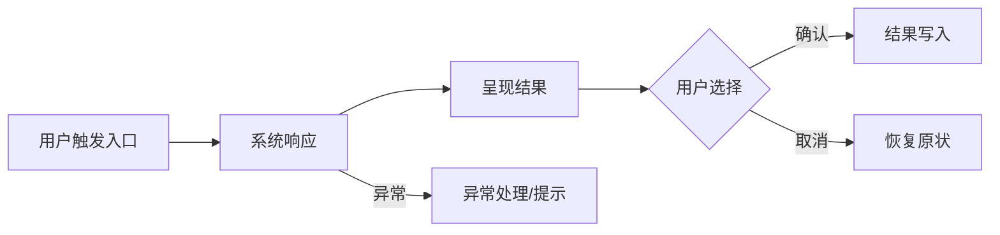

# [ ] 架构信息模板 v1.0 [0/3]

> **协作说明**：本文档由 AI 负责填写，人负责在「五、待决策项」中勾选排除不需要的方式。AI 每次填写前须先完整阅读本模板，按各节说明生成内容，不得跳过任何节，不得自行添加未在模板中定义的节。每次迭代开始前，AI 须将上一版本的完整正文内容移入文件底部「历史归档」区，再用新内容更新顶部正文，并递增标题中的版本号。AI 每次只读顶部正文，不得修改历史归档区的内容。

## 一、需求概述

> 说清楚这次要做什么、为什么做。格式：`[用户/角色] 在 [场景] 中遇到 [问题]，本次在 [模块] 实现 [能力]`。AI 读取本节时，应将其作为需求背景，不得自行扩展或推断未列出的需求。

- 具体需求 1（用户视角，描述痛点或诉求）
- 具体需求 2
- 具体需求 3

## [ ] 二、功能信息架构 [0/1]

> 本节是功能的完整结构全貌。标记说明：✨ 本次新增、✏️ 本次改动、无标注为已有不涉及。每个可交付功能必须分配唯一 `[F#]` 标记，并贯穿二、三、四节保持一致，用于人和 AI 双向追溯「功能 ↔ 数据流 ↔ 文件改动」。AI 修改代码时，只处理带 `[F#]` 标记的节点，不得改动无标注内容。

- 输出规则（AI 必须遵循）
    - 功能标记（用于关联"功能"与"系统架构树上的文件改动"）
        - 每个"可交付功能/能力"必须分配一个 `F` 标记：`[F1]`、`[F2]`、...
        - 该功能在「二、功能信息架构」中出现的所有子节点，行首必须带同一标记：`[F#]`。
        - 该功能在「三、数据流」中涉及到的**所有关键步骤**，行首必须带同一标记：`[F#] ...`。
        - 该功能在「四、系统架构」的架构树中涉及到的**所有文件改动点**，行首必须带同一标记：`[F#] ✨/✏️ ...`。
        - 同一功能如果改动多个文件：允许分散在架构树不同文件节点下，但必须使用同一 `[F#]` 以便回溯。
    - 改动点写法（挂在文件节点下）
        - 每条改动点必须写清：`[F#]` + `✨新增/✏️修改` + "怎么改/改什么"。
        - 若属于下期规划：在改动点末尾追加 `` `[V2]` ``；本期交付则 `` `[V1]` ``。
    - 操作流程输出的是 Mermaid 语法的横置流程图
    - 每一个功能完成后，需要勾选前面的进度复选框
- [ ] 产品功能 [0/1]
    - [ ] 模块名称
        - [ ] 已有功能入口 [0/3]
            - [ ] 已有子功能...
            - [ ] [F1] ✨ 新增功能 A `[MVP]` ← 示例：AI 续写子节点 [0/3]
                - [ ] 状态 / 交互元素 1
                - [ ] 状态 / 交互元素 2
                - [ ] [主操作按钮] / [取消]
            - [ ] [F2] ✨ 新增功能 B `[V2]` ← 下期规划功能 [0/1]
                - [ ] 状态 / 交互元素 1
- 操作流程

## [ ] 三、数据流

> 本节描述用户视角的完整交互链路：用户做了什么、看到了什么、产生了哪些可追踪的数据产物。每个关键步骤必须标注所属 `[F#]`，与二、四节保持对应。AI 读取本节时，应将其作为「预期行为规格」，实现时须覆盖所有步骤，尤其是失败与恢复路径。

- 数据流（按功能节点分类）
    - [F#] 节点：功能节点名称
        - [F#] 步骤 1：用户触发入口（按钮/命令/快捷键/自动触发）
            - 输入：用户提供/选择了什么（文件、文本、选项）
            - 用户可见反馈：UI 状态/提示/禁用态
            - 关键产物（若有）：`requestId` / `jobId` / `docToken` / `mappingKey`
        - [F#] 步骤 2：系统处理中（用户视角的中间态）
            - 用户可见反馈：进度/加载/可取消/可重试
            - 关键状态：处理中/等待中/已完成/已失败（至少列出 3 个状态及切换条件）
        - [F#] 步骤 3：完成与落地（用户视角结果）
            - 输出：用户最终得到什么（链接、文档、同步结果、状态变化）
            - 落地位置：写入到哪里（本地文件、缓存、远端、历史映射）
        - [F#] 步骤 4：失败与恢复（用户可执行动作）
            - 错误提示：给用户看的文案与下一步
            - 恢复手段：重试/回滚/继续/跳过（说明触发条件与限制）
- 观测与排障（必填，尽量简洁）
    - 日志（至少列出字段，不要求给出具体实现）
        - 统一字段：`feature`(F#) / `requestId` / `durationMs` / `result`(ok|fail) / `errorCode`
        - 关键对象字段：与本功能强相关的 1-3 个标识（如 `filePath` / `docToken` / `taskId`）
    - 指标（可选，但建议至少 1 条）
        - 例：成功率、平均耗时、失败码分布（写清"用于回答什么问题"即可）
    - 关键可回放信息（可选）
        - 失败时保留哪些最小信息能复现（例如输入摘要/配置快照/版本号）
- 数据流图（可选）
    - 若使用 Mermaid：只画关键步骤，节点名使用用户动作/用户可见状态，节点前带 `[F#]`。

## 四、系统架构

> 本节是完整系统目录结构，列出所有涉及改动的文件路径。标记说明：✨ 本次新增、✏️ 本次改动、无标注为已有不涉及。每条改动点格式为 `[F#] ✨/✏️ 做什么`，AI 修改代码时以本节为唯一操作依据，不得改动未在此列出的文件。

### 架构摘要

> 本块由 AI 用自然语言描述本次改动的全貌，面向人阅读。AI 须说明：涉及哪些模块、各模块职责是什么、模块之间的关系、以及本次改动对整体架构的影响。不超过 200 字。

（AI 填写示例：本次改动涉及两个模块：shared/ai-service 新增 AI 请求封装层，负责与外部 API 通信，供所有功能复用；features/mindmap 在现有节点编辑入口接入 AI 续写能力，新增独立的 ai-writer.js 处理核心逻辑。两者通过事件总线解耦，mindmap 不直接依赖 ai-service 的实现细节。本次未改动路由、权限、存储层。）

### 架构树

- `src/`
    - `entry.js`
        - [F1] ✏️ 修改：注册/接入新增功能 A 的模块入口与命令（示例）。 `[MVP]`
    - [ ] `shared/` [0/1]
        - `vendor/` · 不涉及
        - [ ] `新增目录/` · ✨ 说明用途 [0/2]
            - [ ] `文件名.js`
                - [F1] ✨ 新增：为新增功能 A 提供共享能力/服务（示例）。 `[MVP]`
            - [ ] `文件名.js`
                - [F2] ✨ 新增：为新增功能 B 提供能力（示例）。 `[V2]`
    - `features/`
        - `模块名/`
            - `子目录/`
                - `index.js`
                    - [F1] ✏️ 修改：接入新增功能 A 的 UI/状态编排（示例）。 `[MVP]`
                - `新文件.js`
                    - [F1] ✨ 新增：实现新增功能 A 的核心逻辑（示例）。 `[MVP]`
                - `新文件.js`
                    - [F2] ✨ 新增：实现新增功能 B 的核心逻辑（示例）。 `[V2]`

## [ ] 五、注意事项 [0/1]

> 本节记录验收标准与待决策项。验收标准是交付的最低要求，AI 完成实现后须逐条自查。待决策项是尚未确定的设计选择，每项列出解决该问题的不同方式与各自好处；人勾选某方式即代表该方式被**排除**，AI 读取时以**未勾选方式**为准，忽略已勾选方式。

- 验收标准清单
    - [ ] 数据流每个关键步骤已标注 `[F#]`，且可回溯到「四、系统架构」的文件改动点
    - [ ] 每个步骤至少说明：输入、用户可见反馈、关键产物（如 requestId/jobId/docToken 等）
    - [ ] 明确失败与恢复：用户怎么做、系统怎么提示、是否可重试/可继续
    - [ ] 日志字段满足定位需要：至少包含 `feature(F#)`、`requestId`、`durationMs`、`result`、`errorCode`
    - [ ] 验收条件描述 1（示例：核心主链路可完整闭环）
    - [ ] 验收条件描述 2（示例：异常路径有清晰提示且可恢复）

- [ ] 待决策项 [0/2]
    - [ ] 问题一 [0/2]
        - [ ] 方式一：描述一种解决这个问题的做法
            - 好处
        - [ ] 方式二：描述另一种解决这个问题的做法
            - 好处
    - [ ] 问题二 [0/2]
        - [ ] 方式一：描述一种解决这个问题的做法
            - 好处
        - [ ] 方式二：描述另一种解决这个问题的做法
            - 好处

---

# 历史归档

> 本区块由 AI 在每次迭代开始时自动归档上一版本的完整正文内容，人可回溯，AI 不主动读取。每次归档格式：`## v[版本号] - [功能名称] [归档日期]`，内容为上一版本正文的完整粘贴。

<!-- 示例（AI 填写时替换为真实内容） ## v1.0 - 登录功能 2026-04-14 （上一版本一至五节的完整内容粘贴于此） -->
