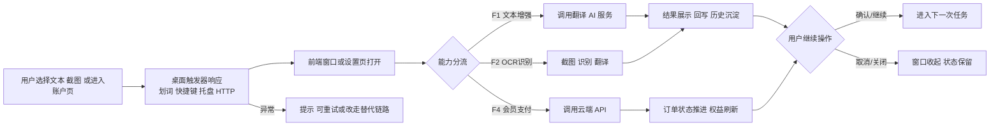

# 项目体检基线-v1 ^c58202bd-5c52-abb5

## [ ] Immersive Input 项目体检基线 v1.0 [0/5] ^a0a3c682-4391-3614
> **协作说明**：本文档基于 `技术方案模板.md` 生成，但当前用途不是描述单次功能开发，而是为 Immersive Input 建立一份“体检式首版基线”。正文记录的是当前项目已经存在的能力、关键链路、风险边界与后续版本规划触点；后续每次做版本规划时，都应先更新顶部正文，再把上一版完整内容归档到底部「历史归档」区。

- 一、需求概述 ^40cce896-a345-516d
> 说清楚这次要做什么、为什么做。格式：`[用户/角色] 在 [场景] 中遇到 [问题]，本次在 [模块] 实现 [能力]`。AI 读取本节时，应将其作为需求背景，不得自行扩展或推断未列出的需求。

	- [产品/研发/运营] 在为 Immersive Input 做后续版本规划时遇到“当前项目真实边界不清、能力分布分散”的问题，本次在 [项目基线治理] 实现 [当前能力盘点与规划锚点沉淀]。 ^0c923335-bd1d-27ec
	- [研发] 在跨桌面端、Rust 本地能力、云端 API、支付计费链路联调时遇到“入口多、链路长、改动触点不集中”的问题，本次在 [架构基线] 实现 [功能域、数据流、文件触点的一次性归档]。 ^1b5bba91-312a-b780
	- [产品/运营] 在讨论商业化、账号体系、插件扩展、管理员能力时遇到“是否已经落地、做到什么程度、还有哪些明显欠账”不清楚的问题，本次在 [版本基线] 实现 [现状、风险、待决策项的统一记录]。 ^45308a9c-2b81-e0ad
- [ ] 二、功能信息架构 [0/1] ^c6c015ce-3b9c-6b4e
> 本节是功能的完整结构全貌。标记说明：✨ 本次新增、✏️ 本次改动、无标注为已有不涉及。每个可交付功能必须分配唯一 `[F#]` 标记，并贯穿二、三、四节保持一致，用于人和 AI 双向追溯「功能 ↔ 数据流 ↔ 文件改动」。对当前这份体检基线而言，`[F#]` 标记表示“后续版本规划必须围绕的现有能力域”。

	- 输出规则（AI 必须遵循） ^fbdc6ecb-9488-af23
		- 功能标记（用于关联"功能"与"系统架构树上的文件改动"） ^b2df46fe-701c-dba8
			- 每个“后续可独立规划的能力域”必须分配一个 `F` 标记：`[F1]`、`[F2]`、... ^70ffaba9-9ad4-f1ef
			- 该能力域在「二、功能信息架构」中出现的所有子节点，行首必须带同一标记：`[F#]`。 ^a5884300-9e6e-b8d2
			- 该能力域在「三、数据流」中涉及到的所有关键步骤，行首必须带同一标记：`[F#] ...`。 ^700c797a-23a7-c917
			- 该能力域在「四、系统架构」中列出的文件触点，行首必须带同一标记：`[F#] ✏️ ...`。 ^1175df35-4fa8-0cc4
			- 对当前基线文档，`✏️` 表示“后续版本规划优先触点”，不是本次已实际修改。 ^5910e68f-67af-164e
		- 改动点写法（挂在文件节点下） ^11d5f5c0-0f7d-deee
			- 每条改动点必须写清：`[F#]` + `✏️ 规划触点` + “为什么这个文件是后续版本演进入口”。 ^b4f3281a-c621-e8e8
			- 当前项目已具备、应视作已上线基线的能力统一追加 `` `[V1]` ``；明确下期建设的能力追加 `` `[V2]` ``。 ^8ffdabee-1cb7-2afb
		- 操作流程输出的是 Mermaid 语法的横置流程图 ^78c43a80-c111-73df
		- 后续真正进入版本迭代时，只在对应 `[F#]` 下面增删内容，避免整份文档失控 ^6f68b7c8-f841-fed6
	- [ ] 产品能力基线 [0/1] ^7886f6dc-6d2a-3269
		- 桌面文本增强主链路 ^a633f888-1617-6223
			- 已有功能入口 ^3fce126b-6eab-411a
				- `Translate` 窗口 ^bbb0ea80-b74b-f17a
				- `LightAI` / `Explain` / `Chat` 窗口 ^8c0800e2-6f3f-1502
				- 浮动工具栏 `FloatToolbar` ^4d69206a-8e1b-2ee6
				- 快捷键 / 托盘 / 本地 HTTP 触发 ^58ff1581-5f98-4146
			- [F1] ✏️ 当前主能力：文本翻译与 AI 文本增强 `[V1]` ^3b59b36a-548f-bab3
				- 划词翻译、输入翻译、图片翻译共用翻译窗口承接 ^cc418989-98bd-9b39
				- 轻 AI 润色支持多风格、多版本生成与回写 ^e9732c75-516b-e90e
				- 解释与对话窗口复用当前选中文本上下文 ^fc5e7a5b-7f4d-ea7b
				- 该能力依赖登录态、服务配置、模型配置与窗口编排稳定性 ^98217dd6-8bcb-1986
		- OCR 与截图识别链路 ^6cc611a0-4386-243d
			- 已有功能入口 ^b2026760-694b-d8ae
				- 快捷键触发截图 OCR / 截图翻译 ^c8b3e30a-04fc-c59f
				- 托盘菜单入口 ^4e1bcb1b-9481-b5fa
				- 外部截图文件 + 本地 HTTP 替代链路 ^4f262bef-3774-c59f
			- [F2] ✏️ 当前主能力：截图识别与图片翻译 `[V1]` ^75a846de-bece-4e3f
				- 框选截图后可进入 `Recognize` 或翻译窗口 ^38fe9133-489f-535a
				- 支持系统 OCR、在线 OCR、二维码与 LaTeX 场景 ^b5b80515-6ab2-4343
				- 各平台截图能力不一致，已有替代方案但体验不完全统一 ^b75d0aca-91a3-57d2
				- 该能力依赖截图缓存、窗口事件与 OCR 服务配置 ^f568b48a-96fb-744f
		- [ ] 桌面触发与交互编排 [0/2] ^c0d516e2-0f43-4e1d
			- [ ] 已有功能入口 [0/3] ^4e110068-4c79-246e
				- [ ] 鼠标划词行为 ^958f8d4a-38d1-d5de
				- [ ] 全局快捷键 ^240b1a60-32ce-d6f6
				- [ ] 本地 HTTP 服务 ❓ ^beaac59c-6baa-e2af
			- [ ] [F3] ✏️ 当前主能力：多入口触发与跨窗口调度 `[V1]` [0/4] ^c241975e-4428-4caa
				- [ ] `text_select_behavior` 决定“工具栏 / 直译 / 禁用”模式 ^9952d556-e68e-f577
				- [ ] Rust 侧负责窗口创建、位置计算、线程隔离与系统级能力 ^f18ab84d-fd7f-f9b6
				- [ ] 本地 `127.0.0.1:60828` 对外暴露核心动作接口 ^2db7a302-d78d-fd49
				- [ ] 该能力是体验中枢，也是 Windows/WebView2 稳定性风险集中区 ^f8819706-8937-7ff8
		- 账号、支付与会员计费 ^68c53653-df3c-ce2d
			- 已有功能入口 ^c883a317-4d6e-f8cf
				- 登录 / 注册 / 重置密码 ^db1b89ab-2d9d-c1d7
				- 设置页 `Account` 页面 ^ae52cd0a-b372-08d4
				- `api/payment` / `api/billing` / `api/admin/billing` ^69294184-15f2-4cfd
				- 独立 `admin-billing.html` + `src/web/AdminBillingPage.jsx` ^6335062c-86f9-3bd8
			- [F4] ✏️ 当前主能力：支付下单、会员发放、退款与会员管理 `[V1]` ^69ea84fc-110f-4376
				- Supabase 登录态 + Bearer Token 驱动后端鉴权 ^d9a5211f-665a-03ee
				- Account 页支持套餐展示、充值、订单轮询、二维码 / 收银台跳转 ^c86547fb-23d9-925f
				- 统一支付网关已收敛到 `custom_orchestrator`，适配 stripe / alipay / wxpay / easypay / noop ^407f8f7a-971c-af80
				- 计费已覆盖每日额度、积分余额、会员续费顺延、退款回滚 ^a1e59124-a2e6-ad8b
				- 管理员支持退款、会员暂停 / 恢复，但完整后台治理仍未成体系 `[V2]` ^b4913876-31e9-80c8
		- 配置、扩展与运行保障 ^a64d2335-9b6d-afe7
			- 已有功能入口 ^ca8a5b8e-8927-6262
				- Config 多页面设置中心 ^614772aa-aad8-e4d4
				- 服务管理 / 插件管理 / 多语言 ^f1147133-5e1e-b725
				- 历史、备份、更新、字体、代理 ^0b0d7a20-2921-308a
				- 测试与联调文档 ^d62abb49-db51-2b07
			- [F5] ✏️ 当前主能力：配置中心与可扩展基础设施 `[V1]` ^99a9d7f4-e741-6172
				- `useConfig` + Tauri store 已形成跨窗口配置同步中枢 ^10cd4a2b-1fd3-0a9a
				- 翻译 / OCR / TTS / 收藏 / 轻 AI 以服务目录扩展 ^c87ffc76-39a1-7a9e
				- 登录、账户、AI 历史、划词设置都已纳入配置页体系 ^3db3f9c2-4e41-94c6
				- 插件体系存在，但插件规范、质量门禁与运营面板仍偏弱 `[V2]` ^bef5386d-08f9-46b7
				- 支付联调文档、测试文件和 README 已承担部分“运行保障说明书”职责 ^74c2c0e7-701e-4b68
	- 操作流程 ^d01afb8f-69d6-7745

		- 新节点 ^a789c36f-241a-fe72
- [ ] 三、数据流 ^e218dac1-e55a-6256
> 本节描述用户视角的完整交互链路：用户做了什么、看到了什么、产生了哪些可追踪的数据产物。每个关键步骤必须标注所属 `[F#]`，与二、四节保持对应。对这份体检基线而言，本节既是“当前真实用户链路”，也是后续版本评审时的行为规格底稿。

	- 数据流（按功能节点分类） ^0eb649b4-292b-4d2f
		- [F1] 节点：桌面文本增强主链路 ^546d1298-74ab-f6bc
			- [F1] 步骤 1：用户通过划词、输入翻译、轻 AI、解释或对话入口触发文本增强 ^68d5f17b-4360-a732
				- 输入：选中文本、手动输入文本、当前服务配置、模型配置 ^83eae7ff-1020-ff63
				- 用户可见反馈：翻译窗 / AI 窗打开、按钮 loading、未登录时被 `AuthGuard` 拦截 ^7c5f0f66-3994-fcfc
				- 关键产物（若有）：`windowLabel` / `textSnapshot` / `serviceId` ^f3554189-41eb-c1b8
			- [F1] 步骤 2：系统处理中 ^e0e84058-de8e-4194
				- 用户可见反馈：翻译结果区域、AI 生成态、可关闭窗口、可切换服务 ^4c463d66-1b0f-671e
				- 关键状态：`idle`（未触发）→ `loading`（请求中）→ `success`（结果返回） / `error`（服务失败） ^285f8b2f-a4f0-96a4
			- [F1] 步骤 3：完成与落地 ^f0ba3dca-40ce-de84
				- 输出：翻译结果、润色版本、解释内容、对话内容、可能的粘贴回写 ^e4bc2060-3326-b408
				- 落地位置：当前窗口状态、历史记录、原输入框粘贴结果、剪贴板 ^8963133a-23d9-1166
			- [F1] 步骤 4：失败与恢复 ^d2650ca1-49fd-aade
				- 错误提示：服务未配置、登录失效、接口失败、模型响应异常 ^b7fc8d7e-39fb-fc03
				- 恢复手段：切换服务、重新触发、关闭后重试、返回配置页修复 ^371af946-b9c1-2477
		- [F2] 节点：OCR 与截图识别链路 ^750f88be-3937-b97e
			- [F2] 步骤 1：用户触发截图 OCR / 截图翻译 ^db4b762a-b0a2-bc1c
				- 输入：屏幕框选区域、截图来源（软件内截图或外部缓存文件）、OCR 服务配置 ^23f20e76-e404-2aff
				- 用户可见反馈：截图选区界面、识别窗打开、识别结果区 loading ^a7e0f1e7-ed1f-6a4b
				- 关键产物（若有）：`imagePath` / `ocrEngine` / `translateService` ^8ad8edab-adcc-8a1c
			- [F2] 步骤 2：系统处理中 ^7b5f3a5b-6c3f-5d5e
				- 用户可见反馈：截图完成后进入 `Recognize` 或 `Translate`、等待识别结果 ^eaf24329-a47d-d4f2
				- 关键状态：`capturing`（截图中）→ `recognizing`（识别中）→ `translated` / `recognized` / `failed` ^e763b4d7-4335-5e5d
			- [F2] 步骤 3：完成与落地 ^0bd7afba-8b0b-7c9e
				- 输出：识别文本、识别后的翻译结果、二维码或公式识别结果 ^98b2a698-c49f-0a6b
				- 落地位置：识别窗口、翻译窗口、缓存截图文件、后续复制或编辑动作 ^8aa7519d-ad64-9dc9
			- [F2] 步骤 4：失败与恢复 ^9aebe43b-ae66-cb9f
				- 错误提示：截图失败、OCR 服务未就绪、Wayland/平台限制、识别超时 ^7ed89292-53b4-3276
				- 恢复手段：改走外部截图链路、切换 OCR 服务、重新截图、仅做识别不做翻译 ^97e31651-b496-d5f6
		- [F3] 节点：桌面触发与交互编排 ^4a7e0caf-203a-5fef
			- [F3] 步骤 1：用户通过划词行为、全局快捷键、托盘或本地 HTTP 触发桌面动作 ^3bcbf24e-cb4a-aa1a
				- 输入：鼠标选中文本、快捷键配置、HTTP 路径、当前窗口上下文 ^f1a50395-7916-ce47
				- 用户可见反馈：浮动工具栏弹出、目标窗口聚焦或打开、本地 HTTP 返回 `ok` ^0356cb19-510b-4397
				- 关键产物（若有）：`triggerType` / `windowLabel` / `serverPort` ^4b9c7ad2-0d93-8edf
			- [F3] 步骤 2：系统处理中 ^545e697c-578a-264c
				- 用户可见反馈：窗口位置跟随鼠标或居中、按钮禁用、窗口创建延迟极短但可感知 ^38b3659d-de7a-3e3f
				- 关键状态：`triggered`（已触发）→ `dispatching`（调度中）→ `opened`（窗口已打开） / `blocked`（被稳定性问题阻塞） ^6804de7e-4f1f-9850
			- [F3] 步骤 3：完成与落地 ^fd4db95d-8ad6-f759
				- 输出：目标窗口被正确唤起，状态写入 Rust 全局状态或配置存储 ^a2a28878-5743-e827
				- 落地位置：Rust 全局状态、Tauri store、本地 HTTP 监听端口、系统托盘状态 ^596ce8b7-dbba-d926
			- [F3] 步骤 4：失败与恢复 ^20e15812-4547-22ee
				- 错误提示：快捷键注册失败、窗口创建卡死、端口占用导致服务迁移、平台权限不足 ^bd67d5cd-26e0-0993
				- 恢复手段：重新注册快捷键、切换触发方式、使用托盘或 HTTP 替代、重启应用 ^e741edcf-8de7-fdae
		- [F4] 节点：账号、支付与会员计费 ^8fabefb5-881a-b012
			- [F4] 步骤 1：用户登录后进入账户页或管理员页，查看套餐 / 余额 / 订单并发起支付或管理动作 ^a35c6c77-0d1b-a385
				- 输入：登录态、用户 ID、套餐、金额、支付渠道、管理员 Token、订单 ID ^4730fb5f-7ae6-b5ee
				- 用户可见反馈：支付渠道 ready 状态、缺失环境变量提示、下单按钮 loading、管理员操作区表单 ^82c4c126-4b53-666d
				- 关键产物（若有）：`userId` / `idempotencyKey` / `paymentProvider` ^1cdedd56-de49-a902
			- [F4] 步骤 2：系统处理中 ^ad399861-d660-34b0
				- 用户可见反馈：创建订单后打开外部收银台或二维码弹窗，订单状态自动轮询 ^178729ac-97a8-d238
				- 关键状态：`PENDING`（待支付）→ `REQUIRES_ACTION`（待用户支付）→ `PAID` / `COMPLETED` / `FAILED` / `CANCELED` / `REFUNDED` ^e3388853-568e-6cfd
			- [F4] 步骤 3：完成与落地 ^7c948344-522e-44c4
				- 输出：订单状态推进、会员到期时间更新、积分余额变化、管理员退款 / 暂停 / 恢复结果 ^9e06623f-f0ef-b94d
				- 落地位置：`payment_orders` / `payment_webhook_events` / `billing_profiles` 等后端数据表、账户页实时展示 ^7f50ae2f-9fa3-099f
			- [F4] 步骤 4：失败与恢复 ^09cd249e-ec70-9a33
				- 错误提示：未登录、配置缺失、订单不存在、权限不足、退款受安全规则拦截 ^22824400-fbcb-bfdc
				- 恢复手段：补齐环境变量、刷新订单状态、重新查询档案、使用管理员接口重放发放或执行人工处理 ^e26297de-bc9c-cbef
		- [F5] 节点：配置、扩展与运行保障 ^d8aca7b8-03db-5f27
			- [F5] 步骤 1：用户进入设置页管理翻译、OCR、AI、划词、服务、插件、备份等配置 ^b8ab658f-885d-1f57
				- 输入：配置项、服务密钥、插件文件、语言与主题、字体与代理设置 ^bb02552a-78b9-b862
				- 用户可见反馈：设置页分区、即时开关、配置项保存、服务列表展示 ^8ca856fa-37c9-7a6a
				- 关键产物（若有）：`configKey` / `serviceType` / `pluginName` ^6866c083-34cc-2a0f
			- [F5] 步骤 2：系统处理中 ^c8ee56b7-d0cb-63e9
				- 用户可见反馈：跨窗口同步生效、部分设置即时影响窗口行为、备份 / 恢复 / 更新有独立状态提示 ^3ead79e1-ab9c-be3f
				- 关键状态：`editing`（编辑中）→ `saving`（保存中）→ `synced`（已同步） / `invalid`（配置无效） ^d4f9eec0-fc6c-f032
			- [F5] 步骤 3：完成与落地 ^03e73868-28e4-7d37
				- 输出：配置持久化、服务可用性变化、插件出现在服务列表中、更新或备份状态刷新 ^75356944-7076-7971
				- 落地位置：Tauri store、本地配置文件、插件目录、README / 联调文档 / 测试文件 ^3f237f5a-5c43-0274
			- [F5] 步骤 4：失败与恢复 ^57329e55-7b9b-99d1
				- 错误提示：插件不兼容、服务密钥缺失、配置无法同步、更新检查失败 ^5ca10919-bffb-d47c
				- 恢复手段：恢复默认配置、移除插件、回滚备份、重启应用后重新加载 ^f182d904-3249-73bc
	- 观测与排障（必填，尽量简洁） ^048a58c4-eaf8-dbed
		- 日志（至少列出字段，不要求给出具体实现） ^4662b1e7-c755-e4fd
			- 统一字段：`feature`(F#) / `requestId` / `durationMs` / `result`(ok|fail) / `errorCode` ^0ae8d049-d7b7-776e
			- 关键对象字段： ^ac616963-0b55-d193
				- [F1] `windowLabel` / `serviceId` / `textLength` ^fd34f8fd-3d76-d648
				- [F2] `imagePath` / `ocrEngine` / `screenshotMode` ^6b915b06-837d-4d3c
				- [F3] `triggerType` / `serverPort` / `windowLabel` ^448ad913-5f97-bb99
				- [F4] `userId` / `orderId` / `provider` ^b4c3024c-e942-bcbb
				- [F5] `configKey` / `serviceType` / `pluginName` ^6a062def-1b6e-d1f2
		- 指标（可选，但建议至少 1 条） ^c68cf99a-aaf7-1d79
			- [F1] 文本增强成功率与平均响应耗时，用于回答“当前主功能是否稳定可用” ^e4035305-e813-3113
			- [F2] OCR 成功率与截图失败率，用于回答“平台差异是否正在吞噬体验” ^1acdda39-875f-bc08
			- [F4] 下单成功率、支付完成率、退款回滚成功率，用于回答“商业化链路是否可运营” ^6c3bf9c8-f024-405c
			- [F5] 配置保存失败数、插件安装失败数，用于回答“扩展能力是否可维护” ^80f1b03d-0011-2d5a
		- 关键可回放信息（可选） ^bd16a2c0-6f5f-97de
			- 输入摘要（文本长度、截图路径、订单号） ^5152c471-907c-3c59
			- 当前配置快照（服务选择、支付适配器、关键环境开关） ^77b843cf-aa92-6eb3
			- 版本号（桌面端版本、API 配置版本、联调日期） ^e99cb036-c585-525d
- 四、系统架构 ^983820d9-780c-a1cb
> 本节是完整系统目录结构，列出所有涉及后续版本规划的主要文件路径。对这份体检基线而言，下面的标记不是“本次已经改动”，而是“未来做版本和功能规划时，优先从这些文件切入”。

	- 架构摘要 ^67212d83-d328-9729
	- 架构树 ^a6f40cb0-d2a2-bdaa
		- `src/` ^fcdba740-fff4-4bbc
			- `App.jsx` ^7cb0ac73-c63d-35bb
				- [F1] ✏️ 规划触点：所有前端窗口的路由装配入口，也是文本增强能力的总开关。 `[V1]` ^4a725ebc-0615-8feb
				- [F5] ✏️ 规划触点：主题、语言、字体、登录守卫的全局注入点。 `[V1]` ^7b0e0d5d-c1a9-8012
			- `hooks/` ^7edd223f-e811-9c91
				- `useConfig.jsx` ^beed177d-ace2-0c7f
					- [F3] ✏️ 规划触点：触发行为依赖的配置读取入口。 `[V1]` ^789d966c-d74e-ab44
					- [F5] ✏️ 规划触点：配置同步与跨窗口广播核心。 `[V1]` ^6a443267-b3ff-871d
				- `useSyncAtom.jsx` ^6dbda9d4-159e-8cfd
					- [F5] ✏️ 规划触点：配置状态和页面状态同步桥。 `[V1]` ^5c747a52-882e-c3c8
			- `utils/` ^3bbbe311-5223-c471
				- `store.js` ^a0969f72-333a-7c66
					- [F5] ✏️ 规划触点：本地配置持久化与 Rust 侧同步中心。 `[V1]` ^7a79e582-b380-3a75
				- `textAnalyzer.js` ^77d08578-4ada-5334
					- [F1] ✏️ 规划触点：浮动工具栏智能按钮与文本类型识别基础。 `[V1]` ^4ff3c109-8f68-c0f8
				- `formatter.js` ^f0fc4f31-8d8a-0084
					- [F1] ✏️ 规划触点：文本处理能力扩展入口。 `[V1]` ^84e5cacc-7995-0845
				- `auth.js` ^6b38b3cf-72da-4337
					- [F4] ✏️ 规划触点：前端登录态缓存、Token 获取与账户体验基线。 `[V1]` ^87f81326-994b-4542
				- `backendApi.js` ^f6da7fd9-6a2c-5e13
					- [F4] ✏️ 规划触点：桌面端访问云端 API 的统一封装层。 `[V1]` ^316fe25a-f0cd-0b1d
					- [F5] ✏️ 规划触点：后端地址探测与错误归一化入口。 `[V1]` ^8a70da17-e709-a314
				- `billing.js` ^0519366b-3204-c5d6
					- [F4] ✏️ 规划触点：计费相关前端调用封装。 `[V1]` ^53e94102-8f48-e98c
				- `payment.js` ^b552a67e-7c66-4646
					- [F4] ✏️ 规划触点：支付相关前端调用封装。 `[V1]` ^90a9f78d-f629-2b0a
				- `admin.js` ^03f52da0-5003-81c7
					- [F4] ✏️ 规划触点：管理员 Token 本地保存与读取逻辑。 `[V1]` ^d27e2299-83b2-0c02
			- `window/` ^597b7c62-bb44-f843
				- `Translate/index.jsx` ^546bbcbb-4b81-60f4
					- [F1] ✏️ 规划触点：翻译主窗口和文本增强结果承接界面。 `[V1]` ^c5f75cb2-6bbf-f911
				- `LightAI/index.jsx` ^8fdeca12-35e1-f027
					- [F1] ✏️ 规划触点：轻 AI 润色交互核心。 `[V1]` ^89be730d-0849-d941
				- `Explain/index.jsx` ^e37e9dbc-1dc4-4815
					- [F1] ✏️ 规划触点：解释型 AI 能力窗口。 `[V1]` ^1a5f6bb1-09a0-ea50
				- `Chat/index.jsx` ^eeea6d05-8475-813d
					- [F1] ✏️ 规划触点：对话型 AI 能力窗口。 `[V1]` ^e3c570cc-0d0a-077b
				- `Recognize/index.jsx` ^f5cbfa9f-3773-66f4
					- [F2] ✏️ 规划触点：OCR 结果呈现与后续编辑入口。 `[V1]` ^fba99d5b-72eb-b0b3
				- `Screenshot/index.jsx` ^9a725e05-a215-6f81
					- [F2] ✏️ 规划触点：截图框选前端交互入口。 `[V1]` ^aa8496f1-110d-5bad
				- `FloatToolbar/index.jsx` ^2c4c3b07-311e-c147
					- [F1] ✏️ 规划触点：文本增强快捷入口与按钮行为编排。 `[V1]` ^093d26d2-de56-4ddb
					- [F3] ✏️ 规划触点：桌面多入口体验最敏感的前端触点。 `[V1]` ^8a88d453-4ec6-f939
				- `Config/routes/index.jsx` ^c32eafde-d89d-1cbd
					- [F5] ✏️ 规划触点：设置页能力组织方式的主路由。 `[V1]` ^4b900bb4-686c-1544
				- `Config/pages/TextSelection/index.jsx` ^3c5cc5d5-0a5a-9629
					- [F3] ✏️ 规划触点：划词行为、工具栏按钮开关与排序配置入口。 `[V1]` ^259d6925-474c-4c96
				- `Config/pages/Account/index.jsx` ^9381836a-8a2f-1b6c
					- [F4] ✏️ 规划触点：账户、支付、计费、管理员操作的桌面主页面。 `[V1]` ^b4d392f9-8680-f0e3
				- `Config/pages/Service/index.jsx` ^8d57e991-9016-1b27
					- [F5] ✏️ 规划触点：翻译 / OCR / TTS / 插件服务治理入口。 `[V1]` ^2b34a8c8-9ba4-9c3b
				- `Config/pages/General/index.jsx` ^8a535748-2de3-2409
					- [F5] ✏️ 规划触点：通用设置、基础体验项集中入口。 `[V1]` ^b9ea9672-3a1f-1f51
		- `src-tauri/src/` ^f4fecc1f-8734-9d85
			- `main.rs` ^e986f9e6-973f-f1f5
				- [F3] ✏️ 规划触点：快捷键、托盘、HTTP、本地能力注册总入口。 `[V1]` ^9c7f7178-6244-4b34
				- [F5] ✏️ 规划触点：插件、日志、配置初始化与应用生命周期入口。 `[V1]` ^f7df4c77-01f2-dd8f
			- `window.rs` ^608d9986-41f4-2734
				- [F1] ✏️ 规划触点：翻译 / AI / 对话窗口的打开策略和位置计算。 `[V1]` ^75195c23-e8cc-b40b
				- [F2] ✏️ 规划触点：截图、识别窗口联动与平台差异处理。 `[V1]` ^9ac39c72-53ab-5127
				- [F3] ✏️ 规划触点：WebView2 线程、窗口创建、防死锁等稳定性核心。 `[V1]` ^d3813985-c63a-1166
			- `mouse_hook.rs` ^2ba6b91d-f35f-7fd8
				- [F3] ✏️ 规划触点：划词自动触发能力根节点。 `[V1]` ^db85b2ed-2069-3ccd
			- `hotkey.rs` ^0553c503-37be-adf5
				- [F3] ✏️ 规划触点：全局快捷键注册与分发逻辑。 `[V1]` ^6c8be730-eba2-464f
			- `server.rs` ^5cf7b474-6b54-22b1
				- [F3] ✏️ 规划触点：本地 HTTP 入口、端口绑定与外部调用协议。 `[V1]` ^fd2f0855-0dd0-93d1
			- `cmd.rs` ^10c65190-5757-8600
				- [F1] ✏️ 规划触点：文本读写、粘贴、剪贴板等与业务交互相关命令。 `[V1]` ^cdd3874f-5b06-14e6
			- `config.rs` ^e465ab4e-f48f-d372
				- [F5] ✏️ 规划触点：Rust 侧配置读写与 reload 一致性。 `[V1]` ^1db1ee09-e5de-9e02
			- `screenshot.rs` ^2e10bace-1758-21ea
				- [F2] ✏️ 规划触点：系统截图能力落点。 `[V1]` ^89f5213c-e0bd-b2bb
			- `system_ocr.rs` ^1955b791-f965-4fab
				- [F2] ✏️ 规划触点：系统原生 OCR 能力落点。 `[V1]` ^584c9f46-4d70-da23
			- `tray.rs` ^78ee7633-ae14-cedb
				- [F3] ✏️ 规划触点：托盘动作编排与状态展示。 `[V1]` ^cedff98f-9827-a2ea
		- `api/` ^19a22641-f2bc-a3c7
			- `auth/register.js` ^f46114b1-83dd-5486
				- [F4] ✏️ 规划触点：注册闭环的后端入口。 `[V1]` ^2fcf103b-2f1f-6d34
			- `auth/send-code.js` ^1f429eb8-7517-cfad
				- [F4] ✏️ 规划触点：验证码发送与注册 / 重置密码前置步骤。 `[V1]` ^e76df42c-66d1-638e
			- `auth/reset-password.js` ^0c7173e7-3881-66fe
				- [F4] ✏️ 规划触点：密码重置链路。 `[V1]` ^9a678b81-8d5d-b4f9
			- `billing/catalog.js` ^e1251543-518c-a667
				- [F4] ✏️ 规划触点：套餐与价格的对外读取入口。 `[V1]` ^e696eda5-6b65-310c
			- `billing/profile.js` ^33479747-5f8a-870e
				- [F4] ✏️ 规划触点：用户会员 / 积分档案读取入口。 `[V1]` ^444af5fd-d28c-b5ab
			- `billing/consume.js` ^1c5572f4-d3a0-3db6
				- [F4] ✏️ 规划触点：额度 / 积分扣减入口。 `[V1]` ^223f9aae-0953-7e4c
			- `payment/config.js` ^a2eb5ab6-d7cd-cfbe
				- [F4] ✏️ 规划触点：支付适配器可用性探测入口。 `[V1]` ^2b8a7344-7c58-b205
			- `payment/create-order.js` ^9921cb46-85f7-a708
				- [F4] ✏️ 规划触点：统一下单入口。 `[V1]` ^a7010db7-bed4-b12f
			- `payment/order-status.js` ^8467f27e-6840-be5c
				- [F4] ✏️ 规划触点：订单轮询和主动同步入口。 `[V1]` ^fd537c96-07b8-5234
			- `payment/webhook.js` ^6288bf7c-b4ac-eea8
				- [F4] ✏️ 规划触点：支付回调验签与状态推进入口。 `[V1]` ^535261d1-264e-3c52
			- `admin/billing.js` ^c6ab5fda-9c8c-582e
				- [F4] ✏️ 规划触点：退款、补发、会员暂停 / 恢复的管理员能力入口。 `[V1]` ^ba35727c-f702-b37a
			- `_lib/requestAuth.js` ^bf9b65a1-b445-a1fc
				- [F4] ✏️ 规划触点：用户 / 管理员鉴权边界。 `[V1]` ^1fa8dd64-a567-5adf
			- `_lib/supabaseAdmin.js` ^0ff6f80b-32ac-c55c
				- [F4] ✏️ 规划触点：服务端 Supabase 管理客户端依赖点。 `[V1]` ^76b4acc3-28a8-a5af
			- `_lib/billing/service.js` ^45c3356a-fb2f-51fb
				- [F4] ✏️ 规划触点：会员发放、退款回滚、会员状态变更核心逻辑。 `[V1]` ^42896075-ada8-55af
			- `_lib/payment/gateway.js` ^43689142-410b-51f9
				- [F4] ✏️ 规划触点：统一支付网关抽象层。 `[V1]` ^d4b70c70-b814-9a62
			- `_lib/payment/config.js` ^b4ce6f83-6487-07b2
				- [F4] ✏️ 规划触点：支付运行时配置解析与收敛策略。 `[V1]` ^0ff1a39c-9b68-042b
			- `_lib/payment/stateMachine.js` ^5ab006dc-1c64-31b6
				- [F4] ✏️ 规划触点：订单状态机规则基线。 `[V1]` ^65bc4e84-b6a9-6f8b
			- `_lib/payment/custom/adapterRegistry.js` ^17d520de-d9b2-91be
				- [F4] ✏️ 规划触点：多支付适配器治理入口。 `[V1]` ^0d69359e-29e6-f7a6
			- `_lib/payment/custom/adapters/stripe.js` ^1937d055-3fc7-c36d
				- [F4] ✏️ 规划触点：Stripe 适配器实现。 `[V1]` ^b8130383-777e-8c15
			- `_lib/payment/custom/adapters/alipay.js` ^8eb57ebe-e831-899b
				- [F4] ✏️ 规划触点：支付宝适配器实现。 `[V1]` ^0057e90e-cffa-c3e8
			- `_lib/payment/custom/adapters/wxpay.js` ^b41495fa-f298-5b0d
				- [F4] ✏️ 规划触点：微信支付适配器实现。 `[V1]` ^95fa189b-8d37-500d
			- `_lib/payment/custom/adapters/easypay.js` ^1d68a9c2-b58d-21b8
				- [F4] ✏️ 规划触点：EasyPay 回退适配器实现。 `[V1]` ^6d12705e-a46c-5c7e
			- `_lib/payment/custom/adapters/noop.js` ^5d9b6ecb-b3a5-4628
				- [F4] ✏️ 规划触点：无副作用占位适配器，便于开发与降级。 `[V1]` ^5c67570a-cb46-15df
		- `src/web/` ^eee54fd5-a9e1-123a
			- `AdminBillingPage.jsx` ^2f36ac5c-7a7c-42b8
				- [F4] ✏️ 规划触点：图形化管理员页面的现有雏形。 `[V1]` ^6c75dce2-cba2-4b69
				- [F4] ✏️ 规划触点：如果要做正式后台，这是最自然的升级入口。 `[V2]` ^26137bdf-d04f-e6f9
		- 根目录与文档 ^adea84e5-039b-b7ad
			- `admin-billing.html` ^f04594dc-3283-af16
				- [F4] ✏️ 规划触点：独立管理员页面入口壳。 `[V1]` ^25b9470c-2df4-443a
			- `README.md` ^70194929-210d-73c5
				- [F2] ✏️ 规划触点：平台能力、外部调用与用户说明的公开基线。 `[V1]` ^67b2932a-83c0-54ed
				- [F4] ✏️ 规划触点：支付与商业化说明已直接写入 README，需要后续持续收敛。 `[V1]` ^6c257584-2b20-4c5e
			- `docs/payment-integration-checklist.md` ^ebb7513e-7dfc-0f0f
				- [F4] ✏️ 规划触点：支付联调与运营验收清单。 `[V1]` ^1b6cbebc-c115-6976
			- `payment.env.example` ^db69aa2a-ee10-fcef
				- [F4] ✏️ 规划触点：支付 / 计费环境变量标准样板。 `[V1]` ^c40f97b2-9fd5-5e22
		- `tests/` ^57b954b7-5270-c47d
			- `payment-core.test.mjs` ^6783cd9d-ea16-ca19
				- [F4] ✏️ 规划触点：支付配置、验签、防重放、状态机核心测试。 `[V1]` ^35f4a9e2-226d-192c
			- `billing-config.test.mjs` ^25d946c0-0241-4ab1
				- [F4] ✏️ 规划触点：计费配置与套餐规则测试。 `[V1]` ^205b70e7-7555-3bce
			- `billing-engine.test.mjs` ^c0d21c8b-0857-c8ac
				- [F4] ✏️ 规划触点：会员发放、额度扣减、积分换算测试。 `[V1]` ^0a21d9af-669e-5beb
			- `billing-service.test.mjs` ^84467e69-18ce-ba38
				- [F4] ✏️ 规划触点：计费服务与支付发放行为测试。 `[V1]` ^8d0265f1-18fb-9057
- [ ] 五、注意事项 [0/1] ^5ff83e9d-0e73-7cab
> 本节记录验收标准与待决策项。对这份体检基线而言，验收标准关注“这份文档是否足够支撑后续版本规划”，待决策项则是当前项目已经暴露出来、但尚未统一结论的方向问题。

	- [ ] 验收标准清单 [2/6] ^79944d9a-0b3c-bc26
		- [x] 五个能力域都能从「二、功能信息架构」回溯到「四、系统架构」中的真实代码触点 ^b9011972-1a1b-16ef
		- [x] 文本增强、OCR、桌面触发、支付计费、配置扩展五条链路均有完整用户视角的数据流描述 ^566337a0-cadf-5363
		- [ ] 已知的跨端边界已明确：桌面本地能力在 `src-tauri/`，云端商业能力在 `api/`，管理页雏形在 `src/web/` ^9c37328e-ca62-7574
		- [ ] 稳定性风险已明确记录：WebView2 线程、平台截图差异、支付适配器配置复杂度、插件治理不足 ^d99722b4-b066-13f5
		- [ ] 支付与计费的自动化测试覆盖点已被纳入基线，可作为后续版本回归门槛 ^29cec1e9-1760-8596
		- [ ] 后续版本规划时，团队可以直接在对应 `[F#]` 下追加 `[V2]/[V3]` 内容，而无需重新发明文档结构 ^cfaa16da-09eb-ee1b
	- [ ] 待决策项 [0/3] ^fd8b95a7-e64f-9d1c
		- [ ] 桌面产品定位是否继续以“文本增强工具”作为绝对主线 [1/2] ^58342bc6-c9ef-7f6c
			- [ ] 方式一：保持桌面效率工具主线，账号 / 支付 / 会员仅作为附属商业化能力 ^aa38ff9c-0e40-592a
				- 好处：产品聚焦，跨端治理和商业系统复杂度可控 ^928ad360-e4f5-7320
			- [x] 方式二：把账号、支付、会员升级为正式业务中台，与桌面端并行演进 ^735a6b8e-68c0-8133
				- 好处：商业化路径清晰，后续可自然延展到更多 web 场景 ^e91f02a7-4c72-3733
		- [ ] 支付通道策略是否继续维持多适配器并行 [1/2] ^bd53dba6-4057-8b4d
			- [x] 方式一：收敛到 1-2 个主支付通道，其余保留为应急回退 ^bcc5938d-845a-5443
				- 好处：联调、风控、测试成本最低，问题定位更直接 ^33ed7ff4-4689-a534
			- [ ] 方式二：保持 stripe / alipay / wxpay / easypay 等多通道并行 ^74c857db-5231-2559
				- 好处：覆盖不同地区和交付场景，渠道弹性更强 ^be05fb69-df53-99dd
		- [ ] 插件与服务治理是否需要进入系统化建设 [1/2] ^c4b64659-d6d0-f823
			- [ ] 方式一：继续以内置服务为主，插件作为补充能力 ^cfba2939-a808-662a
				- 好处：服务质量更可控，支持成本更低 ^d5adb042-aa1c-a6ab
			- [x] 方式二：补齐插件规范、审核、调试与展示体系 ^bf3b76b0-f858-75b7
				- 好处：能更快扩展翻译 / OCR / AI 服务生态，降低内置维护压力 ^194d9bcc-afdd-5569

## 历史归档 ^4d4e5cda-920d-6dae
- 本区块由 AI 在每次迭代开始时自动归档上一版本的完整正文内容，人可回溯，AI 不主动读取。每次归档格式：`## v[版本号] - [功能名称] [归档日期]`，内容为上一版本正文的完整粘贴。 ^f95ceb60-2d00-51af