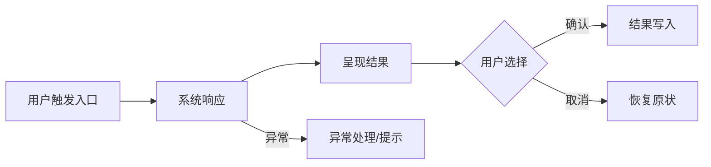

# 技术方案模板 ^d4748217-737a-6fa6

## [ ] 架构信息模板 v1.0 [0/3] ^b956178c-082f-c392
> **协作说明**：本文档由 AI 负责填写，人负责在「五、待决策项」中勾选排除不需要的方式。AI 每次填写前须先完整阅读本模板，按各节说明生成内容，不得跳过任何节，不得自行添加未在模板中定义的节。每次迭代开始前，AI 须将上一版本的完整正文内容移入文件底部「历史归档」区，再用新内容更新顶部正文，并递增标题中的版本号。AI 每次只读顶部正文，不得修改历史归档区的内容。

- 一、需求概述 ^fc4cf9b1-d50c-f7e6
> 说清楚这次要做什么、为什么做。格式：`[用户/角色] 在 [场景] 中遇到 [问题]，本次在 [模块] 实现 [能力]`。AI 读取本节时，应将其作为需求背景，不得自行扩展或推断未列出的需求。

	- 具体需求 1（用户视角，描述痛点或诉求） ^0e801268-249d-f722
	- 具体需求 2 ^1bf7783c-2328-f1c7
	- 具体需求 3 ^294e1936-08ed-a2ae
- [ ] 二、功能信息架构 [0/1] ^8db3e4e0-4948-97a5
> 本节是功能的完整结构全貌。标记说明：✨ 本次新增、✏️ 本次改动、无标注为已有不涉及。每个可交付功能必须分配唯一 `[F#]` 标记，并贯穿二、三、四节保持一致，用于人和 AI 双向追溯「功能 ↔ 数据流 ↔ 文件改动」。AI 修改代码时，只处理带 `[F#]` 标记的节点，不得改动无标注内容。

	- 输出规则（AI 必须遵循） ^6b9dd89f-5457-4123
		- 功能标记（用于关联"功能"与"系统架构树上的文件改动"） ^abdaf180-ceca-dd63
			- 每个"可交付功能/能力"必须分配一个 `F` 标记：`[F1]`、`[F2]`、... ^ec5e9850-54c8-ccf3
			- 该功能在「二、功能信息架构」中出现的所有子节点，行首必须带同一标记：`[F#]`。 ^b405b990-7fd9-8fb7
			- 该功能在「三、数据流」中涉及到的**所有关键步骤**，行首必须带同一标记：`[F#] ...`。 ^bf5f094d-65e9-d3e4
			- 该功能在「四、系统架构」的架构树中涉及到的**所有文件改动点**，行首必须带同一标记：`[F#] ✨/✏️ ...`。 ^8b0d1f5d-6019-813d
			- 同一功能如果改动多个文件：允许分散在架构树不同文件节点下，但必须使用同一 `[F#]` 以便回溯。 ^63d63057-06b6-bb99
		- 改动点写法（挂在文件节点下） ^5b9ad5e7-2972-a58e
			- 每条改动点必须写清：`[F#]` + `✨新增/✏️修改` + "怎么改/改什么"。 ^a3dc5ef7-5f24-8b7d
			- 若属于下期规划：在改动点末尾追加 `` `[V2]` ``；本期交付则 `` `[V1]` ``。 ^9b662539-296f-7897
		- 操作流程输出的是 Mermaid 语法的横置流程图 ^4eb54835-06cf-dfe1
		- 每一个功能完成后，需要勾选前面的进度复选框 ^5667578e-6bbc-8d76
	- [ ] 产品功能 [0/1] ^2c3247c8-be04-76f3
		- [ ] 模块名称 ^bc7ad91a-c22d-8099
			- [ ] 已有功能入口 [0/3] ^5e458951-c9c9-4756
				- [ ] 已有子功能... ^4564fbf9-82d5-30dc
				- [ ] [F1] ✨ 新增功能 A `[MVP]` ← 示例：AI 续写子节点 [0/3] ^3dd63e52-296f-9513
					- [ ] 状态 / 交互元素 1 ^fbd2bb62-7ada-4deb
					- [ ] 状态 / 交互元素 2 ^da65d133-b519-4b5f
					- [ ] [主操作按钮] / [取消] ^fdde6b3f-c994-ef34
				- [ ] [F2] ✨ 新增功能 B `[V2]` ← 下期规划功能 [0/1] ^ce5df2d8-26ef-41e3
					- [ ] 状态 / 交互元素 1 ^b50118f8-f6c7-5df1
	- 操作流程 ^61983796-ffeb-331c

- [ ] 三、数据流 ^65f06f3a-78e4-1667
> 本节描述用户视角的完整交互链路：用户做了什么、看到了什么、产生了哪些可追踪的数据产物。每个关键步骤必须标注所属 `[F#]`，与二、四节保持对应。AI 读取本节时，应将其作为「预期行为规格」，实现时须覆盖所有步骤，尤其是失败与恢复路径。

	- 数据流（用户视角，关键步骤） ^f91944ef-db5a-7d2c
		- [F#] 步骤 1：用户触发入口（按钮/命令/快捷键/自动触发） ^8244251b-db6a-02d6
			- 输入：用户提供/选择了什么（文件、文本、选项） ^78ef4425-abf6-85ad
			- 用户可见反馈：UI 状态/提示/禁用态 ^2f52f962-0ab4-f581
			- 关键产物（若有）：`requestId` / `jobId` / `docToken` / `mappingKey` ^37ac53d2-4d33-b237
		- [F#] 步骤 2：系统处理中（用户视角的中间态） ^e1fda4c9-da53-fd43
			- 用户可见反馈：进度/加载/可取消/可重试 ^226cca83-18f7-c8ea
			- 关键状态：处理中/等待中/已完成/已失败（至少列出 3 个状态及切换条件） ^766aa471-db00-70ea
		- [F#] 步骤 3：完成与落地（用户视角结果） ^6e18f054-1d46-ee44
			- 输出：用户最终得到什么（链接、文档、同步结果、状态变化） ^4ecba3e3-04b7-2b46
			- 落地位置：写入到哪里（本地文件、缓存、远端、历史映射） ^b8865b07-9d18-7411
		- [F#] 步骤 4：失败与恢复（用户可执行动作） ^18e2c44b-fafb-f4cd
			- 错误提示：给用户看的文案与下一步 ^311e8c9d-8c6a-f373
			- 恢复手段：重试/回滚/继续/跳过（说明触发条件与限制） ^df0e16ae-624b-b990
	- 观测与排障（必填，尽量简洁） ^29ad7a64-e0c4-1e64
		- 日志（至少列出字段，不要求给出具体实现） ^699097fc-6515-628b
			- 统一字段：`feature`(F#) / `requestId` / `durationMs` / `result`(ok|fail) / `errorCode` ^fcf321c2-c30a-9dff
			- 关键对象字段：与本功能强相关的 1-3 个标识（如 `filePath` / `docToken` / `taskId`） ^a1c8e2cf-844e-b800
		- 指标（可选，但建议至少 1 条） ^803be292-b255-92cd
			- 例：成功率、平均耗时、失败码分布（写清"用于回答什么问题"即可） ^949bbbb1-5123-fe94
		- 关键可回放信息（可选） ^eabf7dbe-381e-7f1c
			- 失败时保留哪些最小信息能复现（例如输入摘要/配置快照/版本号） ^ddf1e3db-9ff6-aa41
	- 数据流图（可选） ^ce5036a4-3de1-3db8
		- 若使用 Mermaid：只画关键步骤，节点名使用用户动作/用户可见状态，节点前带 `[F#]`。 ^2d156809-4fe6-0d37
- 四、系统架构 ^dae222ec-5697-c622
> 本节是完整系统目录结构，列出所有涉及改动的文件路径。标记说明：✨ 本次新增、✏️ 本次改动、无标注为已有不涉及。每条改动点格式为 `[F#] ✨/✏️ 做什么`，AI 修改代码时以本节为唯一操作依据，不得改动未在此列出的文件。

	- 架构摘要 ^28146bec-09d3-e735
		- 本块由 AI 用自然语言描述本次改动的全貌，面向人阅读。AI 须说明：涉及哪些模块、各模块职责是什么、模块之间的关系、以及本次改动对整体架构的影响。不超过 200 字。 ^56786c03-64f7-f380
	- 架构树 ^43710734-3826-d238
		- `src/` ^1ba60e95-970a-b439
			- `entry.js` ^8273847e-50d1-5cf1
				- [F1] ✏️ 修改：注册/接入新增功能 A 的模块入口与命令（示例）。 `[MVP]` ^734fa76e-5f07-5d45
			- [ ] `shared/` [0/1] ^9355916e-42f7-a295
				- `vendor/` · 不涉及 ^242ba241-17bd-fc8d
				- [ ] `新增目录/` · ✨ 说明用途 [0/2] ^77da035e-8267-2b2d
					- [ ] `文件名.js` ^7fdfe1b1-7f1e-4a07
						- [F1] ✨ 新增：为新增功能 A 提供共享能力/服务（示例）。 `[MVP]` ^244c37e2-b2af-e1b5
					- [ ] `文件名.js` ^2fa85105-7c50-a30a
						- [F2] ✨ 新增：为新增功能 B 提供能力（示例）。 `[V2]` ^99f68ee4-6401-655c
			- `features/` ^c1d419b7-3132-e25c
				- `模块名/` ^ab564828-3939-8fbf
					- `子目录/` ^4b06f77b-d5ae-51b0
						- `index.js` ^915840bf-3a2f-b508
							- [F1] ✏️ 修改：接入新增功能 A 的 UI/状态编排（示例）。 `[MVP]` ^8244a927-733b-db66
						- `新文件.js` ^3da03d31-0344-dfee
							- [F1] ✨ 新增：实现新增功能 A 的核心逻辑（示例）。 `[MVP]` ^d6f7561f-5027-ba5e
						- `新文件.js` ^f8de43bd-386f-4733
							- [F2] ✨ 新增：实现新增功能 B 的核心逻辑（示例）。 `[V2]` ^956fe08a-0d12-6663
- [ ] 五、注意事项 [0/1] ^3f635e49-bc6d-cb4e
> 本节记录验收标准与待决策项。验收标准是交付的最低要求，AI 完成实现后须逐条自查。待决策项是尚未确定的设计选择，每项列出解决该问题的不同方式与各自好处；人勾选某方式即代表该方式被**排除**，AI 读取时以**未勾选方式**为准，忽略已勾选方式。

	- 验收标准清单 ^c0d4cc53-c59e-8411
		- [ ] 数据流每个关键步骤已标注 `[F#]`，且可回溯到「四、系统架构」的文件改动点 ^2e1efe03-1437-3fa3
		- [ ] 每个步骤至少说明：输入、用户可见反馈、关键产物（如 requestId/jobId/docToken 等） ^56e86e26-b042-2737
		- [ ] 明确失败与恢复：用户怎么做、系统怎么提示、是否可重试/可继续 ^245d3fc9-1872-1ae4
		- [ ] 日志字段满足定位需要：至少包含 `feature(F#)`、`requestId`、`durationMs`、`result`、`errorCode` ^a74bbf86-ffb5-d3fa
		- [ ] 验收条件描述 1（示例：核心主链路可完整闭环） ^2413d804-cd88-6b42
		- [ ] 验收条件描述 2（示例：异常路径有清晰提示且可恢复） ^c3f66a16-ab7c-81ef
	- [ ] 待决策项 [0/2] ^9af492d9-3afa-6ad2
		- [ ] 问题一 [0/2] ^26594ae8-ca63-16a1
			- [ ] 方式一：描述一种解决这个问题的做法 ^79b10bf3-e9aa-6be7
				- 好处 ^5fed2053-d522-9b66
			- [ ] 方式二：描述另一种解决这个问题的做法 ^8b4d615d-4415-da37
				- 好处 ^a19ff0b6-b451-08ac
		- [ ] 问题二 [0/2] ^d47ed6ea-9c81-52bb
			- [ ] 方式一：描述一种解决这个问题的做法 ^c7ca0814-9a29-fadb
				- 好处 ^696129b0-69ab-04f6
			- [ ] 方式二：描述另一种解决这个问题的做法 ^f54a02a4-5b8c-94b4
				- 好处 ^1a63976f-2709-bfac

## 历史归档 ^aa3c534e-d647-49b0
- 本区块由 AI 在每次迭代开始时自动归档上一版本的完整正文内容，人可回溯，AI 不主动读取。每次归档格式：`## v[版本号] - [功能名称] [归档日期]`，内容为上一版本正文的完整粘贴。 ^774f97b4-0281-9c7d
